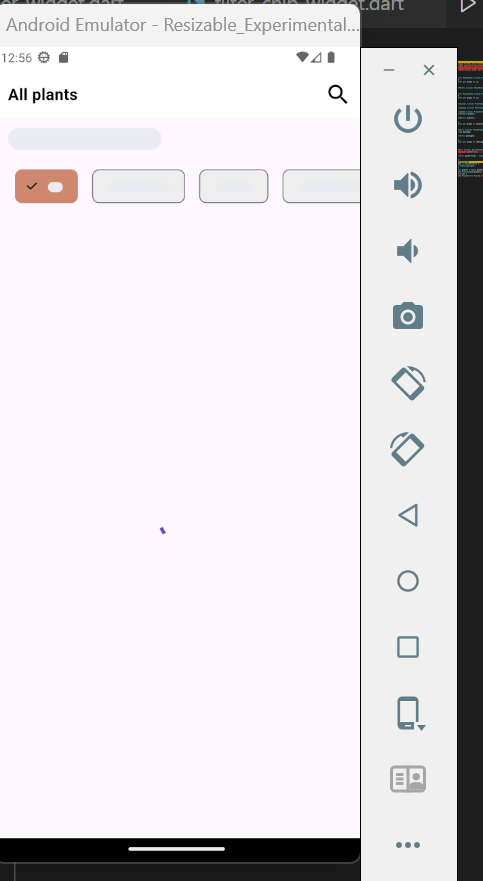
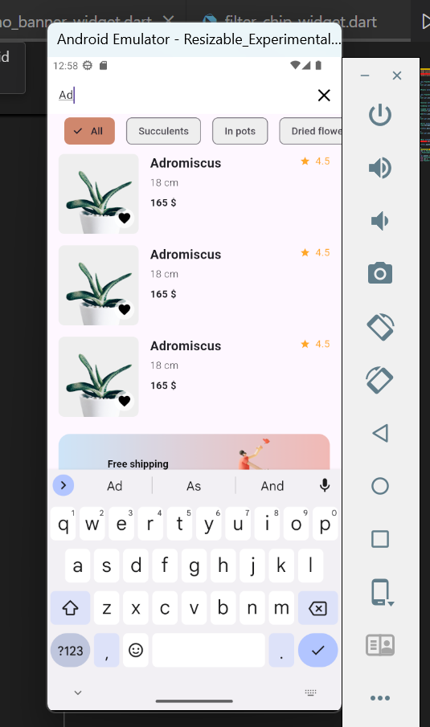
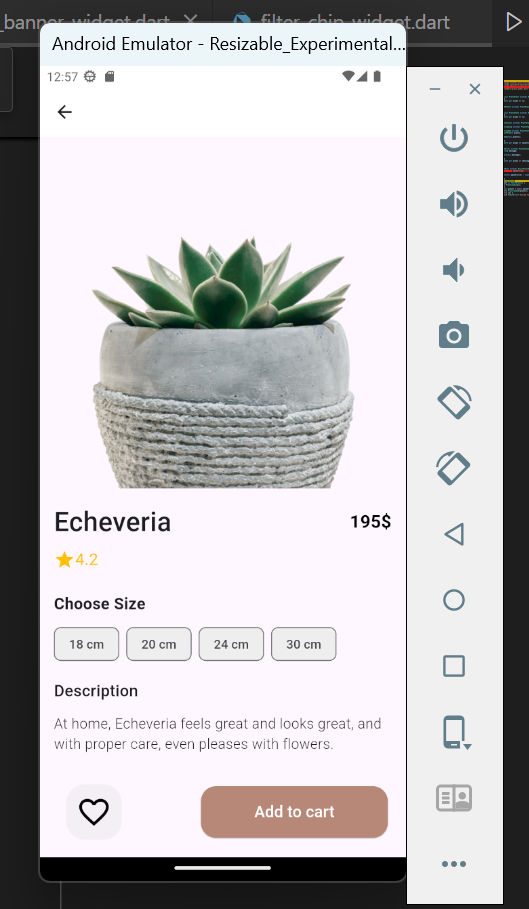

# Thence Assignment

**Thence Assignment** is a Flutter app designed to provide an engaging plant listing experience with search functionality, a banner, and detailed plant information. This app allows users to explore a list of plants, search for specific ones, mark favorites, and view a promotional banner. Skeleton loaders are implemented to enhance user experience while data is being fetched.

## Features

- **Plant Listing**: Browse a list of plants with images.
- **Search Functionality**: Easily search for plants.
- **Favorite Plants**: Mark and view your favorite plants.
- **Skeleton Loader**: Improved user experience while data is loading.
- **Promotional Banners**: Free shipping and other promotional banners.

## Video Demo

Watch a quick demo of the app here:

## Screenshots
1. **Skeleton Screen**  
   

2. **Home Screen**  
   

3. **Search Functionality**  
   

4. **Plant Details**  
   
